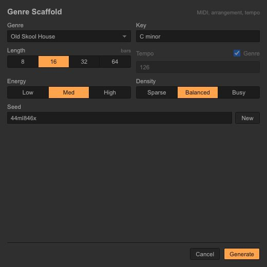

# Ableton Extensions

A monorepo of Ableton Live Extension SDK experiments focused on fast, useful creative tools for writers, producers, and sound designers.

Each extension lives in `extensions/<extension-name>` with its own setup notes, build scripts, tests, and README. The top-level README is the showcase and status board.

## Extensions

### Genre Scaffold



**Status:** MVP packaged, browser QA passing, generation validation passing. Needs one final in-Live import smoke pass before a public release tag.

**Path:** [extensions/genre-scaffold](extensions/genre-scaffold)

**Setup:** [Genre Scaffold setup instructions](extensions/genre-scaffold/README.md#setup)

**What it does:** Generates a stock-only MIDI and arrangement scaffold in Ableton Live. Choose a genre, key, length, tempo behavior, energy, density, and seed; the extension creates tracks, clips, MIDI notes, section markers, and stock-device hints.

**Current genres:**

- Old Skool House
- Tech House
- UK Garage
- Trap
- 90s Hip Hop

**Feature set:**

- Modal Ableton-style UI for generation options
- Deterministic seeds for repeatable variations
- Key, scale, tempo, section, arrangement, density, and energy controls
- MIDI tracks for drums, bass, harmony, lead/chop, and percussion or FX roles
- Stock-only Ableton device hints, with third-party samples/VSTs deferred
- CLI fallback that emits `.json` and multitrack `.mid` examples
- Browser-tested UI at intended and narrow modal sizes

## Repo Layout

```text
.
├── assets/
│   └── screenshots/
├── extensions/
│   └── genre-scaffold/
│       ├── README.md
│       ├── manifest.json
│       ├── src/
│       ├── test/
│       └── package.json
└── README.md
```

## Root Commands

```sh
npm run genre-scaffold:test
npm run genre-scaffold:validate
npm run genre-scaffold:package
```

Use each extension's nested README for detailed setup and Ableton Live Beta instructions.

## Adding Extensions

New extensions should live under `extensions/<slug>` and include:

- `README.md` with setup, status, feature set, and known limitations
- `manifest.json` and build/package scripts
- Tests or smoke validation appropriate to the extension
- A UI screenshot added to `assets/screenshots/` and embedded in this README
